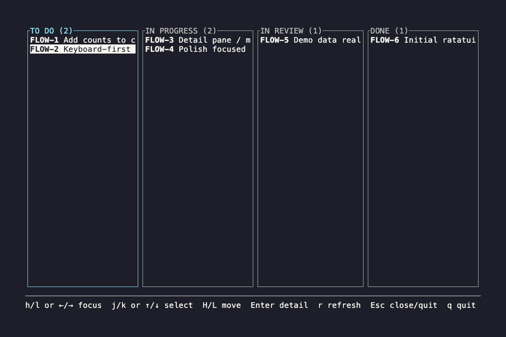

# flow

A keyboard-first Kanban board in your terminal.

Move work between states with a single keystroke and peek at issue descriptions without opening a browser.



## Why
Opening Jira just to move an issue is slow and breaks focus.  
`flow` keeps the common actions fast, local, and keyboard-driven.

This project is intentionally minimal and opinionated.

## Features
- Kanban columns with counts
- One-keystroke transitions (`H` / `L`)
- Toggle issue description (`Enter`)
- `hjkl` or arrow-key navigation
- Clean, Jira-inspired visuals

## Demo mode
`flow` currently runs in **demo mode by default** — no Jira connection required.

Jira integration is planned, but the current focus is the interaction model and UX.

## Keybindings
- `h` / `l` or `←` / `→` — focus column
- `j` / `k` or `↓` / `↑` — select issue
- `H` / `L` — move issue left / right
- `Enter` — toggle description
- `Esc` — close description / quit
- `q` — quit

## Run
```bash
cargo run
```

## Status

Early but usable. Expect breaking changes while the core workflow solidifies.

## License

MIT
